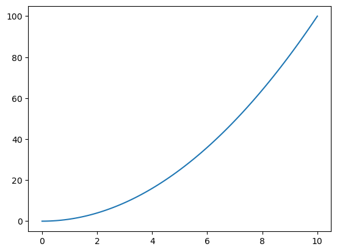

# Jupyter Lab Project Walkthrough

1. Use the 'text editor' feature in Jupyter Lab to create your README.md file.
2. **RENAME YOUR NOTEBOOK FILE IMMEDIATELY** to something relevant
3. CTRL-ENTER executes a cell.

## Markdown cells

This is a markdown cell:

- Headings are \#, \#\#, etc.
- Bold is marked \*\*make me bold\*\* like **this**.
- Italics are marked \*make me italic\* like *this*.
- Math can be typeset with \LaTeX if you know it:  $$f(x)=e^{-x}\cos(x)$$
- Bulleted lists are marked with \-.


```python
# code cells
## Code cells contain python code that gets executed.  
# indicates a comment that is ignored.
print("Hello World!")
```

    Hello World!


In this walkthrough we will look at the following elements of Python in a jupyter notebook.

The print statement


```python
print("hello world!")

```

    hello world!


Variables, variable names, and assignment/datatypes


```python
count = 5 # an integer
name = "Jeremy Teitelbaum" # a string
paragraph = """This is how you enter a multiline string
in python. It is enclosed in triple quotes."""
pi = 3.14159 # a float
epsilon = 1.0e-6 # a float
students = ["Jeremy", "Phillip", "Sara", "Molly"] # a list
HotDog = True


```


```python
print(students)
```

    ['Jeremy', 'Phillip', 'Sara', 'Molly']


Compare `print` for multiline strings with the string value. (\\n means newline)


```python
print(paragraph)
```

    This is how you enter a multiline string
    in python. It is enclosed in triple quotes.


```python
paragraph
```


    'This is how you enter a multiline string\nin python. It is enclosed in triple quotes.'


Arithmetic operations


```python
print(count)
count = count + 1
print(count)
```

    5
    6


```python
1/pi
```


    0.31831015504887655


```python
print(2**3) # exponent
print(1/2) # division (converts integer to float)
print(1/(1/2)) # 2 becomes 2.0
```

    8
    0.5
    2.0


```python
quotient = 5//3 # integer division
remainder = 5 % 3 # remainder
print(quotient, remainder)
```

    1 2


Operations on strings and lists


```python
"Jeremy" + " Teitelbaum"
```


    'Jeremy Teitelbaum'


```python
["a","b","c"]+["d"]
```


    ['a', 'b', 'c', 'd']


```python
len("Jeremy")
```


    6


```python
len(["Jeremy","Teitelbaum"])
```


    2


```python
firstName = "Jeremy"
lastName = "Teitelbaum"
fullName = firstName + " " + lastName

```

    Jeremy
    Teitelbaum
    Jeremy Teitelbaum


Some fancier printing


```python
print(f"The first name is {firstName}")
print(f"The last name is {lastName}")
print(f"The full name is {firstName} {lastName}")
print(firstName, lastName, sep=',')
print(firstName, lastName, sep=':')
```

    The first name is Jeremy
    The last name is Teitelbaum
    The full name is Jeremy Teitelbaum
    Jeremy,Teitelbaum
    Jeremy:Teitelbaum


Slicing

In python, we **always count from zero**!!!


```python
firstName[0]
```


    'J'


```python
lastName[1]
```


    'e'


```python
# [a:b] means from a to b-1 inclusive

print(firstName[0:3])
print(firstName[3:])
print(firstName[3:5])

```

    Jer
    emy
    em
    y


```python
# negative indices count from the end
print(firstName[-1]) # the last element
print(firstName[-3:-1]) # elements -3 and -2, but not -1
```

    y
    em


```python
# [a:b:c] means from a to b-1 in steps of c
# missing numbers mean (beginnging):(end)
print(firstName[:5:2])
print(firstName[::2])
print(firstName[::-1]) # reverse the string
print(firstName[3::-1]) # 3,2,1,0
print(firstName[3:0:-1]) # 3,2,1
```

    Jrm
    Jrm
    ymereJ
    ereJ
    ere


Slices work the same on list elements


```python
print(students[0])
print(students[-1])
every_other_student = students[::2]
print(every_other_student)

```

    Jeremy
    Molly
    ['Jeremy', 'Sara']
    ['Jeremy', 'Sara']


Libraries


```python
import math
```


```python
math.log(23)
```


    3.1354942159291497


```python
math.pi
```


    3.141592653589793


```python
math.cos(math.pi/2) # should be zero
```


    6.123233995736766e-17


```python
math.cos(math.pi/2)==0
```


    False


```python
abs(math.cos(math.pi/2))<1e-6
```


    True


```python
math.pi == pi
```


    False


```python
import numpy as np
```


```python
np.pia
```


    3.141592653589793


```python
print(np.random.randint(0,10))
```

    4


```python
print(np.__version__)
```

    1.24.2


```python
from numpy.random import randint
```


```python
randint(1,10)
```


    7


## Numpy arrays

A numpy array is like a list, but:

    - it's itended for use with numbers
    - it's designed for fast arithmetic and numerical operations
    - it can be multi-dimensional -- like a table or matrix -- although we won't use that here.


```python
x=np.array([1,2,3,4,5,6])
print(x)
```

    [1 2 3 4 5 6]


You access arrays like lists, and can use slices; indices start at zero.


```python
x[2:4]
```


    array([3, 4])


When you apply an operation to an array, it gets applied to every element of the array.


```python
print(f"Square of x is {x**2}")
print(f"1/x is {1/x}")
print(f"cos(x) is {np.cos(x)}")
```

    Square of x is [ 1  4  9 16 25 36]
    1/x is [1.         0.5        0.33333333 0.25       0.2        0.16666667]
    cos(x) is [ 0.54030231 -0.41614684 -0.9899925  -0.65364362  0.28366219  0.96017029]


Some special arrays.


```python
x=np.zeros(10) # 10 zeros
y=np.ones(20) # 20 ones
z=np.linspace(0,10,100) # 100 equally spaced numbers from 0 to 10 **inclusive**
w = np.array(list(range(-10,10,2)))
```


```python
print(w)
```

    [-10  -8  -6  -4  -2   0   2   4   6   8]


```python
print(z)
```

    [ 0.          0.1010101   0.2020202   0.3030303   0.4040404   0.50505051
      0.60606061  0.70707071  0.80808081  0.90909091  1.01010101  1.11111111
      1.21212121  1.31313131  1.41414141  1.51515152  1.61616162  1.71717172
      1.81818182  1.91919192  2.02020202  2.12121212  2.22222222  2.32323232
      2.42424242  2.52525253  2.62626263  2.72727273  2.82828283  2.92929293
      3.03030303  3.13131313  3.23232323  3.33333333  3.43434343  3.53535354
      3.63636364  3.73737374  3.83838384  3.93939394  4.04040404  4.14141414
      4.24242424  4.34343434  4.44444444  4.54545455  4.64646465  4.74747475
      4.84848485  4.94949495  5.05050505  5.15151515  5.25252525  5.35353535
      5.45454545  5.55555556  5.65656566  5.75757576  5.85858586  5.95959596
      6.06060606  6.16161616  6.26262626  6.36363636  6.46464646  6.56565657
      6.66666667  6.76767677  6.86868687  6.96969697  7.07070707  7.17171717
      7.27272727  7.37373737  7.47474747  7.57575758  7.67676768  7.77777778
      7.87878788  7.97979798  8.08080808  8.18181818  8.28282828  8.38383838
      8.48484848  8.58585859  8.68686869  8.78787879  8.88888889  8.98989899
      9.09090909  9.19191919  9.29292929  9.39393939  9.49494949  9.5959596
      9.6969697   9.7979798   9.8989899  10.        ]


```python
## Plotting with matplotlib
```


```python
import matplotlib.pyplot as plt
```


```python
plt.plot(z,z**2)
```


    [<matplotlib.lines.Line2D at 0x7f1f4721acd0>]


    

    


```python
z=np.linspace(-10,10,100)
plt.axes()
plt.plot(z,np.cos(z),color='red')
plt.title("A cosine curve")
plt.grid()
plt.xlim(-10,10)
plt.ylim(-10,10)
plt.xticks(list(range(-10,11)))
plt.xlabel("x")
plt.ylabel("y")

```


    Text(0, 0.5, 'y')


    

    


```python

```
